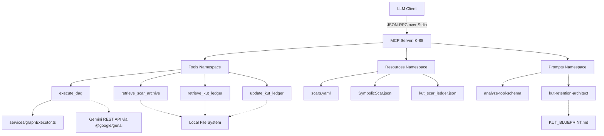
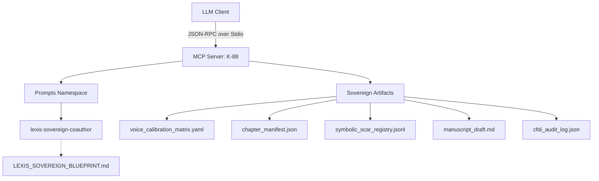

/// file: architecture.md ///
Root: React/Vite
├── Auth: None — N/A
├── DB: LocalStorage — Browser API
├── API: Gemini API — REST via @google/genai
├── UI: Tailwind CSS — Utility classes
└── Infra: Node — Vite Dev Server

DATA FLOWS:
User → [UI] → [API] → [UI] → [DB]

MEREOLOGICAL MAP:
Component ∈ Service ∈ Module ∈ Root

UPCOMING STRATEGIC SHIFTS:
- UI: Transitioning to Graph/Node-based canvas (e.g., React Flow).
- Data: Expanding types to support Directed Acyclic Graphs (DAGs) for prompt lineage and evolutionary tracking.
- Sharing: Introducing import/export mechanisms for Collaborative Blueprints.

### Pluriversal Topological Shift (AEW v2.1)
The data structures have shifted from linear state objects to Directed Acyclic Graphs (DAGs) using `PipelineGraph`, `PipelineNode`, and `PipelineEdge`. This topology enables node-based processing and combinatorial branching paths.

Additionally, `EvolutionaryLineage` models have been implemented to track 'breeding' across nodes, mathematically structuring offspring characteristics using genetic weights.

### PHASE 2 TOPOLOGY: DAG Mapping & KUT Integration

Capability Declarations Required:
- tools/list
- tools/call
- resources/list
- resources/read
- prompts/list
- prompts/get

Betti-1 Risk Analysis:
- Circular dependencies detected: None (β₁ = 0). The DAG maps cleanly from client to independent tool execution paths.
- Overlapping tool namespaces: None. Names are distinct `execute_dag` and `retrieve_scar_archive`.

### Phase 3 Topology: LEXIS SOVEREIGN (The Auteur Co-Author)
A new autonomous agent, LEXIS SOVEREIGN, is introduced to the SCOS framework to manage long-form content generation (ghostwriting) and combat Semantic Saponification and Epistemic Amnesia.

Topological Considerations:
- Enforces strict separation between Manifold α (Voice) and Manifold β (Structure) to avoid Projection Tax.
- Relies on Draft-Conditioned Constrained Decoding (DCCD) to decouple semantic generation from structural formatting.
- Continues the use of Symbolic Scars for evolutionary error correction across long generation sessions.
