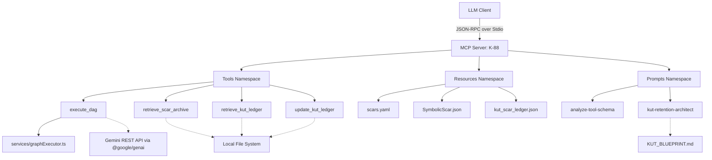
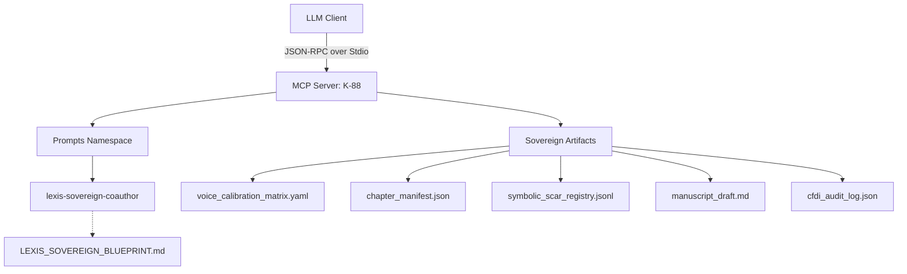
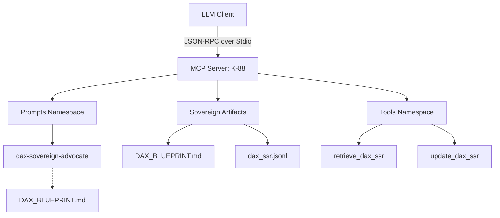
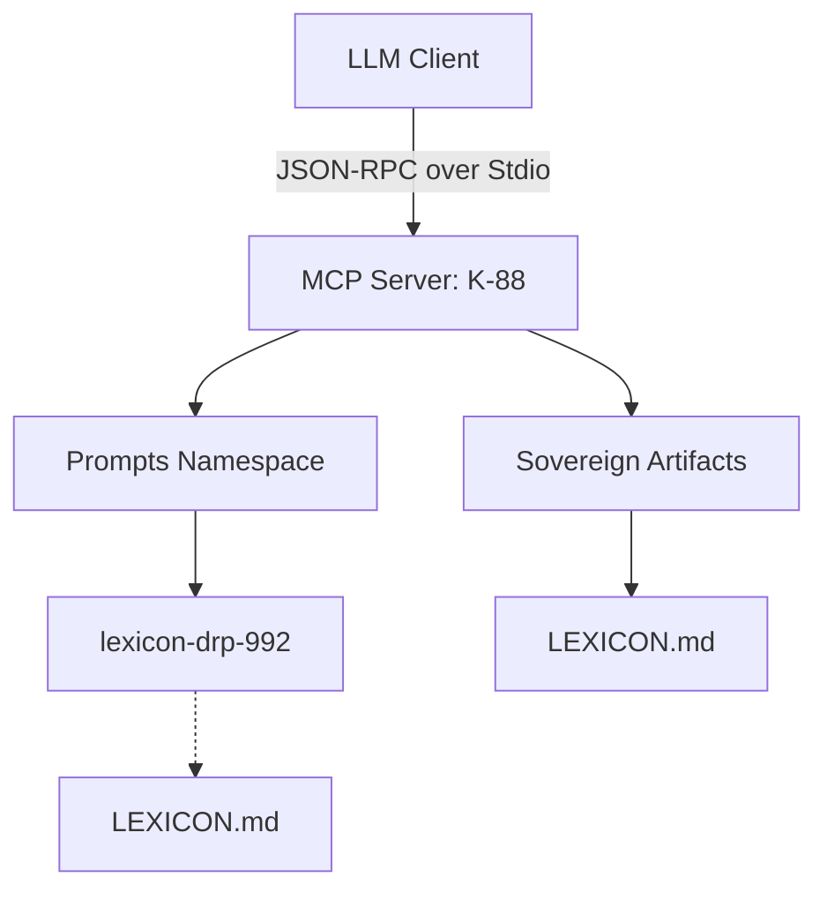
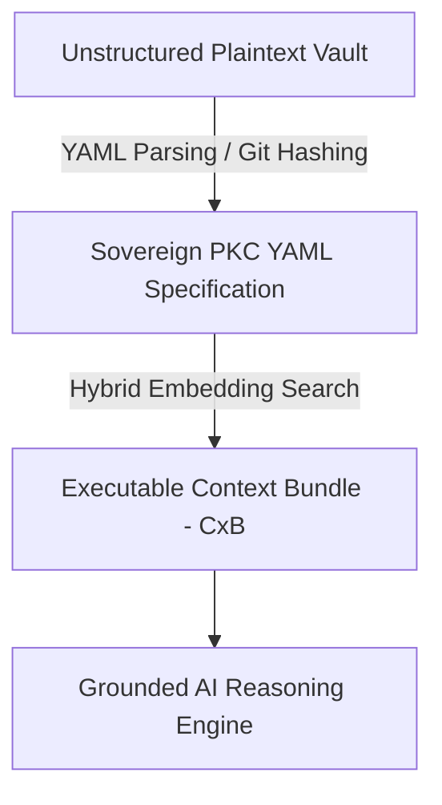

/// file: architecture.md ///
Root: React/Vite
├── Auth: None — N/A
├── DB: LocalStorage — Browser API
├── API: Gemini API — REST via @google/genai
├── UI: Tailwind CSS — Utility classes
└── Infra: Node — Vite Dev Server

DATA FLOWS:
User → [UI] → [API] → [UI] → [DB]

MEREOLOGICAL MAP:
Component ∈ Service ∈ Module ∈ Root

UPCOMING STRATEGIC SHIFTS:
- UI: Transitioning to Graph/Node-based canvas (e.g., React Flow).
- Data: Expanding types to support Directed Acyclic Graphs (DAGs) for prompt lineage and evolutionary tracking.
- Sharing: Introducing import/export mechanisms for Collaborative Blueprints.

### Pluriversal Topological Shift (AEW v2.1)
The data structures have shifted from linear state objects to Directed Acyclic Graphs (DAGs) using `PipelineGraph`, `PipelineNode`, and `PipelineEdge`. This topology enables node-based processing and combinatorial branching paths.

Additionally, `EvolutionaryLineage` models have been implemented to track 'breeding' across nodes, mathematically structuring offspring characteristics using genetic weights.

### Epistemic Cognitive Harness (PEACE Meta-Architecture)

The architecture integrates the PEACE Meta-Architecture to resolve the thought-action gap. This harness decouples intuitive proposal generation from deliberative logical validation.

- **Retrieval Module**: Contextual priors (RAG).

- **Cognition Module**: Fast, associative hypothesis generation (System 1).

- **Control Module**: BDI solver enforcing logical consistency via symbolic verification.

- **Memory Module**: Dynamic Context Tree (ReCAP) managing state recursively.

- **Action Module**: Environmental execution.

### PHASE 2 TOPOLOGY: DAG Mapping & KUT Integration

```mermaid
graph TD;
    Client[LLM Client] -->|JSON-RPC over Stdio| Server[MCP Server: K-88];
    Server --> Tools[Tools Namespace];
    Tools --> Tool1[execute_dag];
    Tools --> Tool2[retrieve_scar_archive];
    Tools --> Tool3[retrieve_kut_ledger];
    Tools --> Tool4[update_kut_ledger];

    Server --> Resources[Resources Namespace];
    Resources --> Res1[scars.yaml];
    Resources --> Res2[SymbolicScar.json];
    Resources --> Res3[kut_scar_ledger.json];

    Server --> Prompts[Prompts Namespace];
    Prompts --> Prm1[analyze-tool-schema];
    Prompts --> Prm2[kut-retention-architect];

    Tool1 --> Executor[services/graphExecutor.ts];
    Tool1 -.-> API[Gemini REST API via @google/genai];

    Tool2 -.-> FS[Local File System];
    Tool3 -.-> FS;
    Tool4 -.-> FS;
    Prm2 -.-> FS_Blueprint[KUT_BLUEPRINT.md];
```

Capability Declarations Required:
- tools/list
- tools/call
- resources/list
- resources/read
- prompts/list
- prompts/get

Betti-1 Risk Analysis:
- Circular dependencies detected: None (β₁ = 0). The DAG maps cleanly from client to independent tool execution paths.
- Overlapping tool namespaces: None. Names are distinct `execute_dag` and `retrieve_scar_archive`.

### Phase 3 Topology: LEXIS SOVEREIGN (The Auteur Co-Author)
A new autonomous agent, LEXIS SOVEREIGN, is introduced to the SCOS framework to manage long-form content generation (ghostwriting) and combat Semantic Saponification and Epistemic Amnesia.

```mermaid
graph TD;
    Client[LLM Client] -->|JSON-RPC over Stdio| Server[MCP Server: K-88];
    Server --> Prompts[Prompts Namespace];
    Prompts --> Prm3[lexis-sovereign-coauthor];

    Server --> Artifacts[Sovereign Artifacts];
    Artifacts --> Art1[voice_calibration_matrix.yaml];
    Artifacts --> Art2[chapter_manifest.json];
    Artifacts --> Art3[symbolic_scar_registry.jsonl];
    Artifacts --> Art4[manuscript_draft.md];
    Artifacts --> Art5[cfdi_audit_log.json];

    Prm3 -.-> FS_LS[LEXIS_SOVEREIGN_BLUEPRINT.md];
```

Topological Considerations:
- Enforces strict separation between Manifold α (Voice) and Manifold β (Structure) to avoid Projection Tax.
- Relies on Draft-Conditioned Constrained Decoding (DCCD) to decouple semantic generation from structural formatting.
- Continues the use of Symbolic Scars for evolutionary error correction across long generation sessions.

### Phase 4 Topology: DAX-01 (Sovereign Developer Advocate)
A new autonomous agent, DAX-01, is introduced to the SCOS framework to act as a Tier 2 Genuine Agency node focused on DevRel. It functions to combat Semantic Saponification and minimize Time-To-First-Call (TTFC).

```mermaid
graph TD;
    Client[LLM Client] -->|JSON-RPC over Stdio| Server[MCP Server: K-88];
    Server --> Prompts[Prompts Namespace];
    Prompts --> Prm4[dax-sovereign-advocate];

    Server --> Artifacts[Sovereign Artifacts];
    Artifacts --> Art6[DAX_BLUEPRINT.md];
    Artifacts --> Art7[dax_ssr.jsonl];

    Server --> Tools[Tools Namespace];
    Tools --> Tool5[retrieve_dax_ssr];
    Tools --> Tool6[update_dax_ssr];

    Prm4 -.-> FS_DAX[DAX_BLUEPRINT.md];
```

Topological Considerations:
- Enforces code first, prose second via the `+++DCCDSchemaGuard` constraint.
- Relies on Empathy-Code Transduction.
- Uses a Symbolic Scar Registry (SSR) to form an autophagic feedback loop and compute Confidence-Fidelity Divergence Index (CFDI) scores.

### Cognitive Lexicon Integration (DRP-LEXICON-992)
The DRP-LEXICON-992 Cognitive Bytecode standard has been integrated to define systemic pattern schemas (e.g., Isomorphic Bridge, Paraconsistent Scarring, Workflow Narrowing Effect) and PDL v1.0 Decorator Registries.

```mermaid
graph TD;
    Client[LLM Client] -->|JSON-RPC over Stdio| Server[MCP Server: K-88];
    Server --> Prompts[Prompts Namespace];
    Prompts --> Prm5[lexicon-drp-992];

    Server --> Artifacts[Sovereign Artifacts];
    Artifacts --> Art8[LEXICON.md];

    Prm5 -.-> FS_LEX[LEXICON.md];
```

Topological Considerations:
- Introduces core pattern definitions and boundary conditions (e.g. Ontological Shear, Epistemic Sclerosis).
- Explicitly maps Progressive Disclosure Level (PDL) activators to systemic remedies, providing rigorous Cognitive Bytecode structures to guide Pluriversal operations.

### VORTEX-ARCHITECT Validation Layer
The application implements strict deterministic boundaries on prompt generation via the VORTEX-ARCHITECT persona.
*   **VORTEX-ARCHITECT Validator:** A deterministic gatekeeper that mathematically enforces Causal Sculpting. It checks the DAG for missing `dccdSchema` values on Enforcer nodes or missing anchors on Stigmergic Lock nodes, halting execution and producing a Justified Uncertainty Report (JUR) if Semantic Saponification is imminent.

### Phase 5 Topology: Context Engineering 2.0 (PKC Framework)
The system transitions from an un-indexed "bag of words" into a formally bounded **Personal Knowledge Corpus (PKC)** utilizing a `pkc_manifest.yml` schema.

```mermaid
graph TD;
    Client[Unstructured Plaintext Vault] -->|YAML Parsing / Git Hashing| Schema[Sovereign PKC YAML Specification];
    Schema -->|Hybrid Embedding Search| Bundle[Executable Context Bundle - CxB];
    Bundle --> Engine[Grounded AI Reasoning Engine];
```

Topological Considerations:
- **Neuro-Symbolic Latent Space Alignment (RMSA)**: Configures bounding spheres (hyperspherical radius) for valid RAG queries via `meaning_space_anchor` metadata, rejecting AI outputs that diverge beyond the allowable semantic radius.
- **Data Integrity & Cryptographic Sealing**: `.git/hooks/pre-commit` automates context hashing to detect state desynchronization.
- **Flesh-to-Symbol Ingestion**: `zotero_ingestion_loop.py` asynchronously parses external inputs and generates typed `semantic_edges` with epistemic tagging to construct relational logic graphs.

### JIT Swarm Orchestrator (SCOS v6.0-STRICT)
This application employs the JIT Swarm Orchestrator architecture to decouple the cognitive workload across distinct Verifiable Cognition Stack (VCS) layers to enforce absolute alignment at runtime:

1.  **Hollow-Core Semantic Planning (Manifold α):**
    The orchestrator maintains a highly compacted, "Hollow Core" context, stripped of heavy, passive tool definitions and OpenAPI schemas. High-level strategic reasoning is executed freely at elevated temperatures inside Manifold α.
2.  **Ephemeral JIT Micro-Agents (Manifold β):**
    For physical, state-mutating transactions, the orchestrator dynamically instantiates specialized, short-lived JIT Micro-Agents. This exploits ultra-low (~3μs) initialization latency and minimal (~6.5KiB) memory footprints to isolate the tooling tax, preventing Context Rot.
3.  **Draft-Conditioned Constrained Decoding (DCCD):**
    The JIT agent applies DCCD logit-masking. The unconstrained semantic draft is projected onto a rigid Abstract Syntax Tree (AST) schema via token-level grammar rules, eliminating the 10-30% Projection Tax.
4.  **CFDI Sensing & Verification Co-Processing (VCP):**
    The system monitors the Confidence-Fidelity Divergence Index (CFDI). If CFDI breaches the Algorithmic Shame threshold (≥ 0.15), the Verification Co-Processor (VCP) intercepts the KV cache, injecting Differentiable Cache Augmentation ("soft tokens") to steer attention maps onto an aligned geodesic.
5.  **SCoRe Self-Correction & The Three-Attempt Limit:**
    Self-repair is governed by a strict three-attempt limit. If compilation fails thrice, a Saga Compensating Transaction triggers a non-destructive filesystem rollback.
6.  **Failure Metabolism (STA & F-IPI):**
    Failed trajectories are serialized as Symbolic Scars in the Scar Tissue Archive (STA). The Failure-Informed Prompt Inversion (F-IPI) engine mutates the master constitution, prepending scars as negative constraints to project repulsive forces against historical errors.
7.  **Justified Uncertainty Reports (JUR):**
    Upon entering escrow, token emissions are frozen, and a cryptographically bound JUR is exported to hand over cognitive load to a human operator.

### Chaos-Engineered Falsification & The IKEA Effect Harness

To mitigate **Agency Laundering** and evaluate **Conceptual Blending Theory (CBT)** models inside the cognitive harness, the architecture has been expanded with three active verification systems tracking the team's visual SMM (Shared Mental Model):

1. **Chrono-Topological Tracker (`ChronoTopologicalTracker`):** Uses Zigzag Persistence Homology conceptual analogues to identify $b_0$ disjoint set component spikes (Semantic Fragmentation) and $b_1$ logical cycles (Contradictions).
2. **Speculative Abstract Interpretation Engine (`SpeculativeAbstractInterpretationEngine`):** Converts the layout into a Product Requirements Prompt (PRP) via the `VisualToDSLCompiler` and sweeps it to mathematically enforce limits such as Data Residency and State Mutation.
3. **Chaos Engine (`ChaosEngine`):** Automates the injection of epistemic pathogens (Concept Drift, Instrumental Convergence, Semantic Ambiguity) to syntheticly simulate **Frictionless Usability** collapse and rigorously trip the **Epistemic Escrow Circuit Breaker** (`triggerEpistemicEscrow`) over the CFDI bounds of $0.42$.

### Parsimonious Architecture Protocol (PAP)

To implement Occam's Razor inside the automated scientific reasoning system and address systemic failure modes like overfitting (Ptolemaic Epicyclic Curve-Fitting), this architecture utilizes the **Parsimonious Architecture Protocol (PAP)**.

PAP acts as an epistemic gatekeeper by compiling scientific theories into directed acyclic graphs and programmatically enforcing the "Simplest Adequate Approximation" using a structural complexity penalty (Occam Loss Score).

#### PAP 4-Module Structure

1. **Ontological Commitment Engine (KRR)**
   - Formulates competing graphs G_1 (Simple) and G_2 (Complex).
   - Binds each node to empirical variables and verification metrics.

2. **Occam Loss Compiler**
   - Computes complexity score C(G) based on parameter dimension and assumption density.
   - Evaluates prediction error E(G) against real-world test sets.

3. **Pareto Optimization Module**
   - Runs multi-objective gradient descent on the Complexity-Accuracy frontier.
   - Selects the "Simplest Adequate Approximation" to prevent greedy reductionism.

4. **Continuous Falsification Unit**
   - Subjects the chosen model to asymptotic edge-case stress-testing.
   - Detects model breakdown to trigger iterative re-parameterization.

#### PAP Verification Matrix

| Module | Input | Output | Verification Metric | Source Grounding |
| :--- | :--- | :--- | :--- | :--- |
| **Ontological Commitment** | Raw Empirical Data | Directed Acyclic Graph (DAG) | Minimum Consistent (MINCON) argument structure. | |
| **Occam Loss Compiler** | Competing Theories ($T_1, T_2$) | Loss Score ($\mathcal{L}_{\text{Occam}}$) | Structural complexity penalty matching Bayesian marginal likelihood. | |
| **Pareto Optimization** | Competing Graphs | Optimal Model ($M^*$) | Distance to the Pareto frontier of simplicity vs. accuracy. | |
| **Continuous Falsification** | Chosen Model ($M^*$) | Falsification Target | Detection of a single $3\sigma$ anomaly (Modus Tollens). | |
