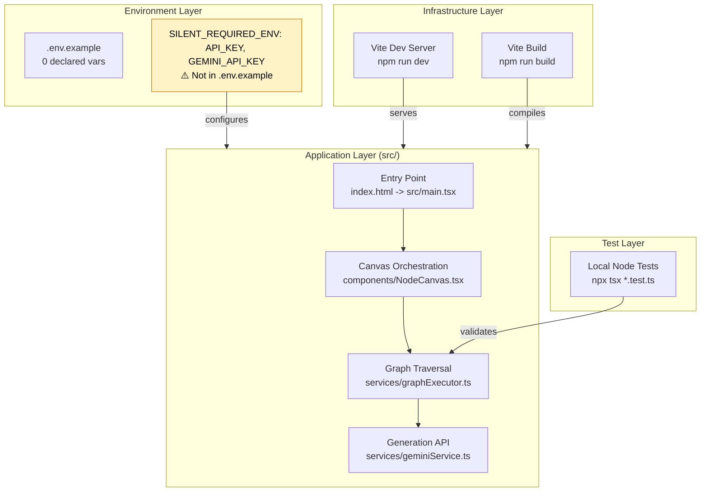

## Architecture Topology Map

> Generated via Mycelial CI Trace (DRP_7_PATTERN_MODEL).
> Betti-1 Cycle Status: CLEAN (No CI workflows detected)
> Dependency Graph Depth: 4 (max: 8)

```mermaid
graph TD
    subgraph ENV["Environment Layer"]
        D2[.env.example<br/>0 declared vars]
        D4[SILENT_REQUIRED_ENV: API_KEY, GEMINI_API_KEY<br/>⚠️ Not in .env.example]
    end

    subgraph APP["Application Layer (src/)"]
        A1[Entry Point<br/>index.html -> src/main.tsx]
        A2[Canvas Orchestration<br/>components/NodeCanvas.tsx]
        A3[Graph Traversal<br/>services/graphExecutor.ts]
        A4[Generation API<br/>services/geminiService.ts]
    end

    subgraph INFRA["Infrastructure Layer"]
        I1[Vite Dev Server<br/>npm run dev]
        I2[Vite Build<br/>npm run build]
    end

    subgraph TEST["Test Layer"]
        T1[Local Node Tests<br/>npx tsx *.test.ts]
    end

    D4 -->|configures| APP
    A1 --> A2
    A2 --> A3
    A3 --> A4
    I1 -->|serves| APP
    I2 -->|compiles| APP
    T1 -->|validates| A3

    classDef warning fill:#fef3c7,stroke:#d97706,color:#000
    classDef golden fill:#fde68a,stroke:#b45309,color:#000

    class D4 warning
```
