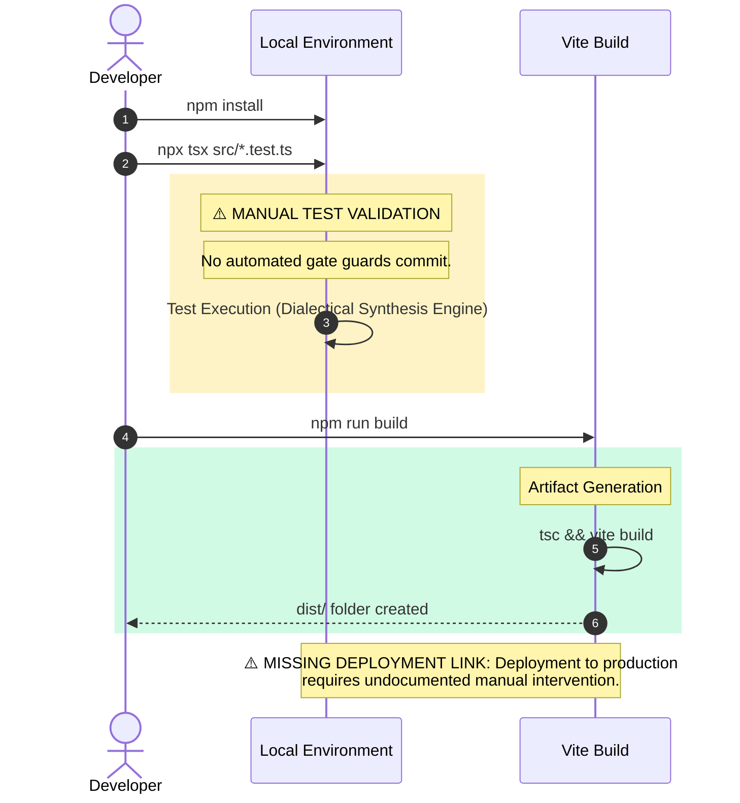

## CI/CD Pipeline Cartograph

> AST-to-YAML Reverse Trace complete.
> Temporal Flow: Left → Right = Commit → Production.
> ⚠️ No automated CI/CD pipelines detected. All operations are manual execution.

