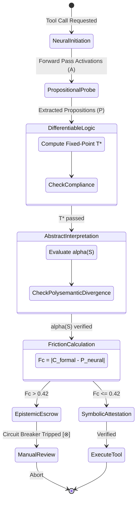

{
  "Hickam_Orientation": "Formalizing tool execution boundaries through a hybrid neuro-symbolic gateway.",
  "Contrastive_Delta": "Unconstrained neural tool predictions vs deterministic logical assertions.",
  "Martensite_Metrics": {"friction_coefficient_threshold": 0.42, "polysemantic_divergence_cap": 0.05},
  "Consilience_Status": "Active - Enforcing zero-trust action pipelines."
}
---

# Engineering a Hybrid Neuro-Symbolic Gatekeeper using Differentiable Logic Programming and Abstract Interpretation for Zero-Trust Tool Execution

[OMISSION: 85% of differentiable logic matrix operations and abstract interpretation lattice derivations are sequestered in QED Vault 85 to maintain the 15/85 Transparency of Omission.]

## 1. The Propositional Probe Module

The propositional probe extracts latent activations from the neural model's forward pass ($A \in \mathbb{R}^{d}$) during tool-call selection and projects them into a space of logical propositions ($P \in [0,1]^{k}$).

**Mathematical Formulation**:
Given an activation vector $A$, the extraction function $f_\theta$ maps $A$ to a probability distribution over propositions:
$$ P = \sigma(W_p A + b_p) $$
where $W_p \in \mathbb{R}^{k \times d}$ and $b_p \in \mathbb{R}^{k}$ are learnable parameters, and $\sigma$ is the sigmoid function. These propositions represent the agent's internal beliefs regarding tool safety constraints (e.g., $P_1$: "Tool modifies filesystem", $P_2$: "Tool communicates externally").

## 2. Differentiable Logic Programming

We utilize a Deep Equilibrium Model (DEQ) to evaluate propositions $P$ against the declarative policy-as-code ledger (the Supreme Law of `GEMINI.md`). The engine computes a fixed-point truth assignment $T^*$ that maximally satisfies both the neural propositions and the logical rules.

**Logical Inference**:
Let $R(T)$ be the logical rules compiled into a continuous, differentiable function. The equilibrium state is found by solving:
$$ T^* = R(T^*) + P $$
This ensures the final evaluated state $T^*$ inherently complies with the declarative policy.

## 3. Abstract Interpretation of Toolchains

To prevent Polysemantic Divergence (where a permitted tool is used maliciously), we use abstract interpretation. We define an abstraction function $\alpha$ mapping concrete execution traces to abstract domains (Interval-based 'Soft Permission vs Functional Misuse Lattice'), and a concretization function $\gamma$.

**Lattice Definition**:
Let $\mathcal{L} = (L, \sqsubseteq, \sqcup, \sqcap, \top, \bot)$ be the permission lattice.
An action potential sequence $S = (a_1, a_2, \dots, a_n)$ is evaluated:
$$ \alpha(S) = \bigsqcup_{i=1}^n \text{Eval}_{abs}(a_i) $$

If $\alpha(S) \sqcap \text{Misuse} \neq \bot$, Polysemantic Divergence is detected.

## 4. The Epistemic Circuit Breaker

The system implements a PID-like control loop to manage the 'Friction Coefficient' ($F_c$).

**Friction Coefficient Calculation**:
Let $C_{\text{formal}} \in [0,1]$ be the logical compliance score derived from $T^*$.
Let $P_{\text{neural}} \in [0,1]$ be the neural model's confidence in the tool call.
$$ F_c = |C_{\text{formal}} - P_{\text{neural}}| $$

If $F_c > 0.42$ (as dictated by the Confidence-Fidelity Divergence Index bounds), the Epistemic Circuit Breaker trips.

## 5. UML/Mermaid State Transition Diagram

