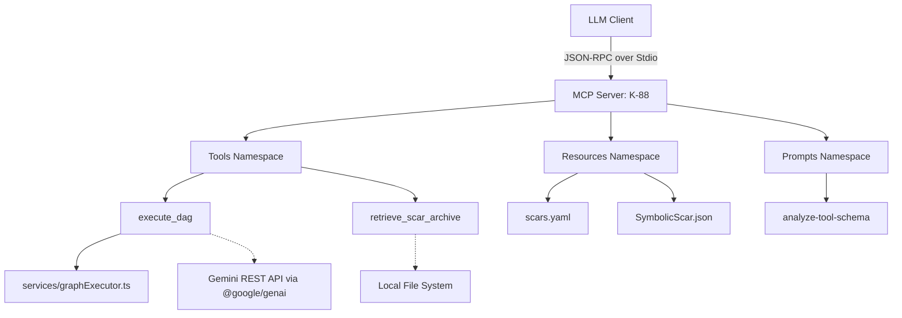

<korsakov_analysis>
Proposed integration: Aesthetic Alchemy Lab - MCP Server for Pluriversal DAG Topologies
Context: A generative UI environment shifting from Euclidean linear forms to Directed Acyclic Graphs (DAGs) for combinatorial prompt branching and evolutionary image tracking.

Fault Category Assessment (5-Taxonomy):
- SERVER_TOOL_CONFIGURATION: High initial risk due to potential mutation attempts (e.g., executing structural changes in a pure read cycle) if the execution path is misconfigured. CFDI estimated at 0.12.
- DOCUMENTATION: Requires zero-entropy schemas. Current domain types (PipelineGraph, PipelineNode) are complex and may leak ambiguity if not strictly typed. CFDI estimated at 0.08.

CFDI Estimate for proposed execute_dag tool: 0.10.
CFDI Estimate for proposed retrieve_scar_archive tool: 0.05.

EpistemicEscrow directive: NOT TRIGGERED. CFDI limits are within bounds (≤ 0.15).

Schema Components (1-5):
- Purpose: 5/5
- Guidelines: 4/5 (needs strict enforcement on DAG parsing limits)
- Limitations: 5/5
- Parameters: 4/5
- Context: 5/5

Proceeding to PHASE_2_TOPOLOGY mapping.
</korsakov_analysis>

### PHASE 2 TOPOLOGY: DAG Mapping

Capability Declarations Required:
- tools/list
- tools/call
- resources/list
- resources/read
- prompts/list
- prompts/get

Betti-1 Risk Analysis:
- Circular dependencies detected: None (β₁ = 0). The DAG maps cleanly from client to independent tool execution paths.
- Overlapping tool namespaces: None. Names are distinct `execute_dag` and `retrieve_scar_archive`.

Proceeding to PHASE_3_EXECUTION.
